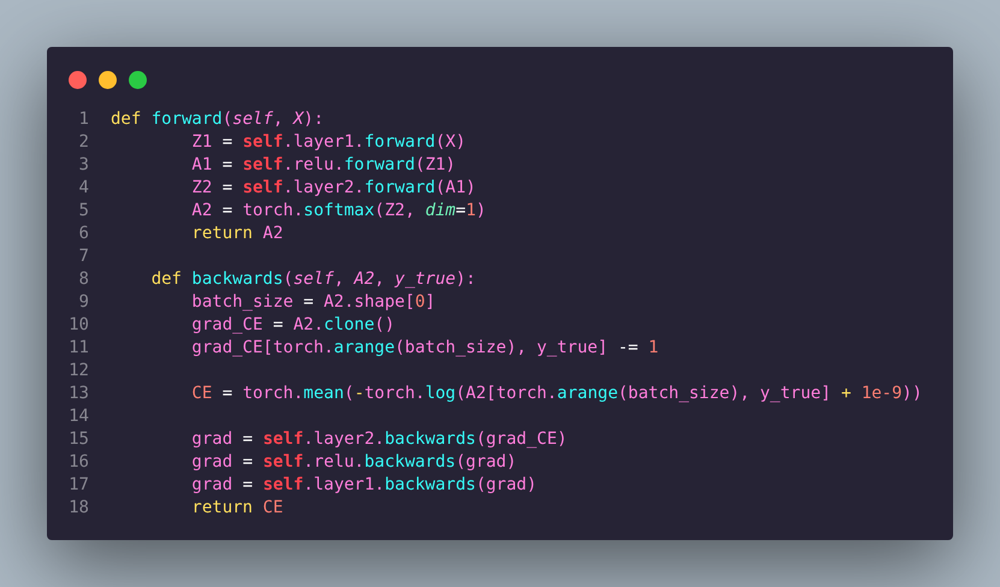
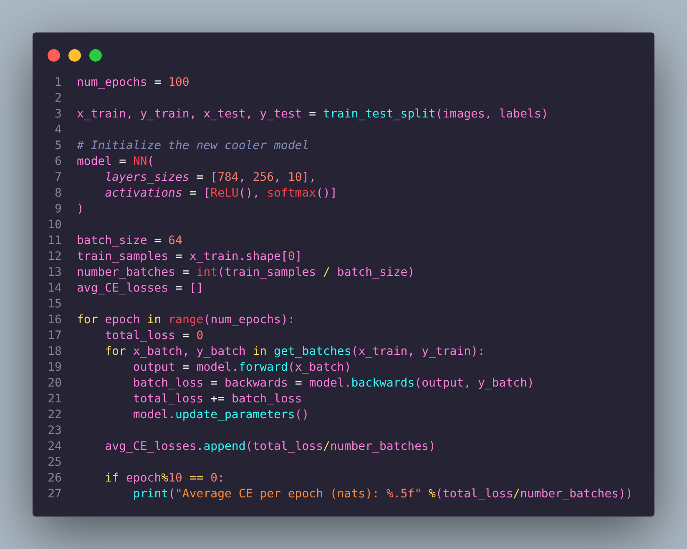
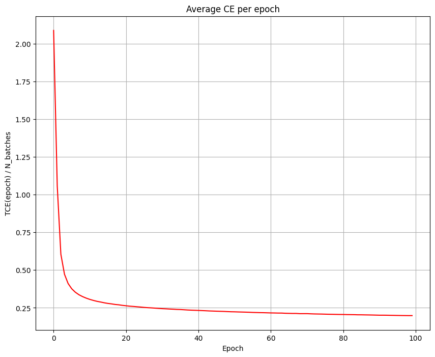
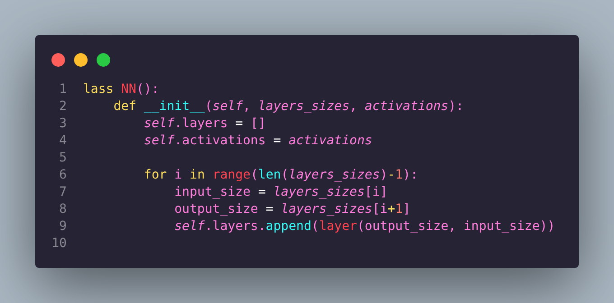
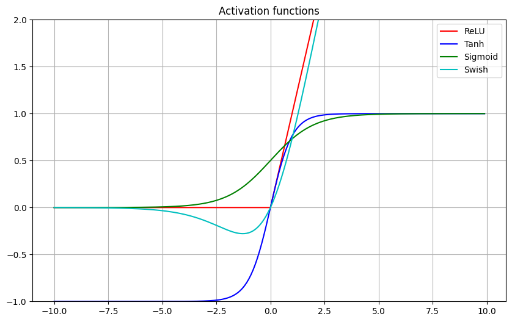

# NeuralNetFromScratch


A simple neural network implemented from scratch in Python using **NumPy** and **PyTorch**.  
This project is designed for learning and experimentation with deep learning fundamentals, including forward/backward propagation, training, and visualization of data. 
This project does not aim to achieve high efficiency or compete with advanced libraries like PyTorch, TensorFlow, or JAX. Its purpose is simply to build a low-level, easy-to-understand neural network for classification tasks, helping users learn the inner workings of neural networks from the ground up.

---

## Features
 
- Forward and backward propagation implemented manually

- Training and validation loops implemented manually

- Visualize training loss

- Modular neural network layers for easy experimentation

- Supports multiple activation functions: ReLU(), Tanh()

- Experiment with hyperparameters: learning rate, batch size, epochs
- Jupyter Notebook demonstrations included
- Train on custom datasets

---


## Installation

1. **Clone the repository:**

```bash
git clone https://github.com/Hugopeb/NeuralNetFromScratch.git
cd NeuralNetFromScratch
```

2. **Create a virtual environment**

```bash
python -m venv NeuralNetFromScratch_VENV
source NeuralNetFromScratch/bin/activate
```

3. **Install required packages**

```bash
pip install -r requirements.txt
```

## Usage / Examples

After installing dependencies and setting up the virtual environment, you can explore and run the project in two ways:

### Using the Jupyter Notebook
Open the notebook to interactively run experiments and explore the network:

```bash
jupyter notebook Main_notebook.ipynb
```

Each cell explains step-by-step the solutions implemented 
at each stage.You can modify datasets, hyperparameters, 
or network layers to experiment. Visualizations such as training 
loss and predictions are included.


### Using the Python script

If someone wants to **run training automatically**:

```bash
python model.py
```

This way you can just train a neural network on your specific
classification problem. I used the MNIST handwritten dataset
but the model could be extrapolated to any other simple
classification problem. Moreover, the model is fairly low level so all classes and functions can easily be changed if needed

## Project Structure

Here’s an overview of the files and folders in this project:

- **Main_notebook.ipynb**: Ideal for exploring the network interactively and understanding each step of the implementation.  
- **model.py**: Contains the classes and functions defining your neural network layers and forward/backward passes.  
- **images/**: Visual outputs to showcase results, like loss curves or sample predictions.  
- **requirements.txt**: Install all Python packages needed with `pip install -r requirements.txt`.  
- **README.md**: This file, explaining the project, how to use it, and providing examples.
- **LICENSE**: File containing the MIT License. 
 
## License

This project is licensed under the **MIT License**.  

You are free to use, copy, modify, merge, publish, distribute, sublicense, and/or sell copies of this project, under the following conditions:

- The above copyright notice and this permission notice shall be included in all copies or substantial portions of the Software.  

**Disclaimer:** The software is provided "as is", without warranty of any kind, express or implied. The authors are not responsible for any claims, damages, or other liabilities.

For the full license text, see the [LICENSE](LICENSE) file.
